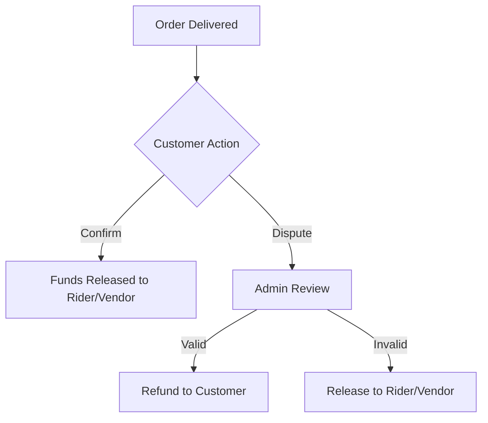
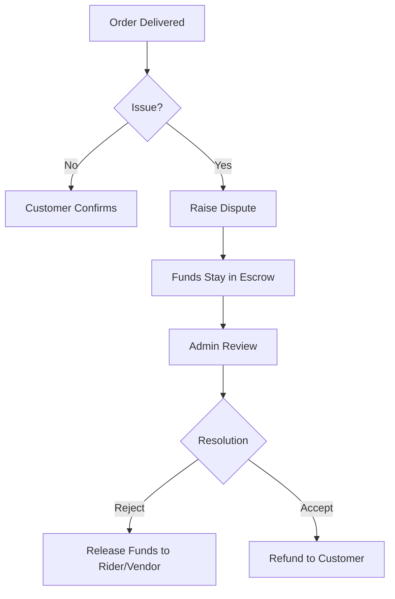

 Zippa Logistics — System Architecture

> **Last Updated:** March 2026
> **Authors:** Development Team
> **Status:** Production (Render + PostgreSQL)

---

 1. Overview

Zippa Logistics is a full-stack logistics platform allowing **Customers** to send packages, **Riders** to deliver them, and **Vendors** to sell marketplace items. The system includes real-time tracking, an AI chatbot, wallet/escrow payments via Paystack, and push notifications via Firebase.

 Tech Stack

| Layer | Technology | Purpose |
|-------|-----------|---------|
| **Mobile App** | Flutter (Dart) | Android & iOS client |
| **Backend API** | Node.js + Express.js | REST API server |
| **Database** | PostgreSQL (Supabase) | Relational data storage |
| **Payments** | Paystack API | Wallet funding, DVA, withdrawals |
| **Email** | Gmail REST API (OAuth2) | OTP verification, password resets |
| **Push Notifications** | Firebase Cloud Messaging | Real-time alerts to users |
| **AI Chatbot** | Google Gemini API | In-app support assistant |
| **Hosting** | Render.com (API) + Supabase (DB) | Backend API + PostgreSQL hosting |
| **CI/CD** | GitHub Actions | Automated linting & testing |

---

 2. Project Structure
Zippa Logistics/
├── zippa-backend/               Node.js API server
│   ├── src/
│   │   ├── app.js               Express app entry point
│   │   ├── config/
│   │   │   ├── database.js      PostgreSQL connection pool
│   │   │   ├── schema.sql       Full database schema (16 tables)
│   │   │   └── firebase-service-account.json
│   │   ├── controllers/         Business logic (13 controllers)
│   │   ├── middleware/
│   │   │   └── auth.middleware.js    JWT auth + role authorization
│   │   ├── routes/              Route definitions (12 route files)
│   │   ├── services/            External integrations (6 services)
│   │   │   ├── email.service.js      Gmail REST API (OAuth2)
│   │   │   ├── paystack.service.js   Paystack payments
│   │   │   ├── notification.service.js   Firebase push
│   │   │   ├── ai_agent.service.js   Google Gemini chatbot
│   │   │   ├── whatsapp.service.js   WhatsApp bot
│   │   │   └── landmark.service.js   Landmark/address lookup
│   │   └── utils/
│   │       └── fare_calculator.js    Delivery pricing logic
│   ├── .env.example             Environment variable template
│   ├── .eslintrc.json           Linting rules
│   └── package.json
│
├── zippa-app/                   Flutter mobile application
│   └── lib/
│       ├── main.dart            App entry point
│       ├── core/
│       │   ├── providers/       State management (ChangeNotifier)
│       │   └── widgets/         Shared UI components
│       ├── data/
│       │   └── api/             ApiClient (HTTP calls to backend)
│       └── features/
│           ├── auth/            Login, Register, OTP screens
│           ├── customer/        Customer screens (17 screens)
│           ├── rider/           Rider screens
│           ├── vendor/          Vendor screens (5 screens)
│           └── chat/            AI chatbot screen
│
└── .github/workflows/
    └── backend-ci.yml           CI pipeline (lint + test)

---

 3. Backend Architecture

 3.1 Design Pattern: MVC (Model-View-Controller)

Request → Route → Middleware → Controller → Service/DB → Response

| Layer | Folder | Responsibility |
|-------|--------|---------------|
| **Routes** | `src/routes/` | Maps URL + HTTP method to a controller function |
| **Middleware** | `src/middleware/` | JWT authentication, role authorization |
| **Controllers** | `src/controllers/` | Core business logic, DB queries, response formatting |
| **Services** | `src/services/` | External API integrations (Paystack, Gmail, Firebase) |
| **Config** | `src/config/` | Database connection, schema, Firebase credentials |
| **Utils** | `src/utils/` | Pure helper functions (fare calculation) |

 3.2 Coding Conventions

- **Single quotes** for all strings (enforced by ESLint).
- **Async/await** for all asynchronous operations (no raw Promises).
- **Error handling**: Every controller wraps logic in `try/catch` and returns `{ success: false, message: '...' }`.
- **SQL queries**: Raw SQL via `pg` library (no ORM). Parameterized queries with `$1, $2` to prevent SQL injection.
- **Naming**: `snake_case` for DB columns, `camelCase` for JS variables.
- **UUID primary keys** on all tables (not auto-increment integers).

 3.3 Authentication Flow

1. User registers → password hashed with bcrypt → stored in DB
2. User logs in → server verifies password → returns JWT access token (1h) + refresh token (7d)
3. App stores tokens in secure storage
4. Every API request includes: Authorization: Bearer <access_token>
5. auth.middleware.js verifies JWT → loads user from DB → attaches req.user
6. authorize('rider') checks req.user.role against allowed roles
7. When access token expires → app calls /api/auth/refresh-token with the refresh token

 3.4 API Routes Summary

| Route Prefix | Auth Required | File | Description |
|-------------|:---:|------|-------------|
| `POST /api/auth/register` | ❌ | `auth.routes.js` | Create account (sends OTP email) |
| `POST /api/auth/verify-email` | ❌ | `auth.routes.js` | Verify OTP code |
| `POST /api/auth/login` | ❌ | `auth.routes.js` | Login (returns JWT) |
| `POST /api/auth/forgot-password` | ❌ | `auth.routes.js` | Send password reset OTP |
| `POST /api/auth/reset-password` | ❌ | `auth.routes.js` | Reset password with OTP |
| `GET /api/users/profile` | ✅ | `user.routes.js` | Get current user profile |
| `PUT /api/users/profile` | ✅ | `user.routes.js` | Update profile |
| `PUT /api/users/location` | ✅ | `user.routes.js` | Update rider GPS location |
| `POST /api/users/kyc` | ✅ | `user.routes.js` | Submit KYC (Multi-part: Doc + Selfie) |
| `POST /api/orders/estimate` | ✅ | `order.routes.js` | Get fare estimate (inc. Surge) |
| `POST /api/orders` | ✅ | `order.routes.js` | Place order (inc. Scheduled) |
| `GET /api/orders` | ✅ | `order.routes.js` | List orders (role-filtered) |
| `GET /api/orders/:id` | ✅ | `order.routes.js` | Get single order |
| `PUT /api/orders/:id/status` | ✅ 🏍️ | `order.routes.js` | Update delivery status |
| `PUT /api/orders/:id/cancel` | ✅ 👤 | `order.routes.js` | Cancel pending order |
| `PUT /api/orders/:id/confirm` | ✅ 👤 | `order.routes.js` | Confirm delivery (release funds) |
| `GET /api/wallet/balance` | ✅ | `wallet.routes.js` | Get wallet + virtual account |
| `GET /api/wallet/transactions` | ✅ | `wallet.routes.js` | Transaction history |
| `POST /api/wallet/fund` | ✅ | `wallet.routes.js` | Initialize Paystack payment |
| `POST /api/wallet/withdraw` | ✅ | `wallet.routes.js` | Request bank withdrawal |
| `POST /api/webhooks/paystack` | ❌ | `webhook.routes.js` | Paystack event handler |
| `GET /api/admin/stats` | ✅ 🔑 | `admin.routes.js` | Dashboard statistics |
| `GET /api/products` | ✅ | `product.routes.js` | List marketplace products |
| `POST /api/chat` | ✅ | `chat.routes.js` | AI chatbot message |
| `GET /api/health` | ❌ | `app.js` | Server health check |

> 🏍️ = Rider only, 👤 = Customer only, 🔑 = Admin only

---

 4. Database Schema

PostgreSQL with **16 tables**. All primary keys are UUIDs.
mermaid
erDiagram
    users ||--o{ user_profiles : has
    users ||--o{ orders : "places/delivers"
    users ||--o{ wallets : owns
    users ||--o{ notifications : receives
    users ||--o{ kyc_documents : uploads
    users ||--o{ chat_messages : sends
    orders ||--o{ ratings : "rated via"
    orders ||--o{ order_chat_messages : "has chat"
    wallets ||--o{ wallet_transactions : logs
    users ||--o{ withdrawals : requests
    vendor_categories ||--o{ products : contains
    users ||--o{ products : sells

 Key Tables

| Table | Purpose | Key Columns |
|-------|---------|-------------|
| `users` | All users (customer/rider/vendor/admin) | `id`, `email`, `phone`, `role`, `fcm_token`, `kyc_status` |
| `user_profiles` | Extended profile (vehicle, bank, business) | `user_id`, `vehicle_type`, `payout_bank_code`, `business_name` |
| `orders` | Every delivery | `order_number`, `customer_id`, `rider_id`, `status`, `total_fare`, `scheduled_at`, `surge_multiplier` |
| `kyc_documents` | Verification documents | `user_id`, `document_url`, `selfie_url`, `status` |
| `wallets` | User balances | `user_id`, `balance`, `pending_balance`, `virtual_account_number` |
| `wallet_transactions` | Financial audit trail | `wallet_id`, `type` (credit/debit), `amount`, `reference` |
| `products` | Marketplace items | `vendor_id`, `name`, `price`, `image_url` |
| `notifications` | In-app notification history | `user_id`, `title`, `body`, `type`, `is_read` |
| `ratings` | Post-delivery star ratings | `order_id`, `from_user`, `to_user`, `stars` |
| `withdrawals` | Bank payout requests | `user_id`, `amount`, `status`, `transfer_code` |

 Order Lifecycle

pending → accepted → arrived → picked_up → delivered → (customer confirms) → funds released
   ↓
cancelled (refund if wallet payment)

 Payment Status Flow

held → released (on customer confirmation)
held → refunded (on cancellation)

---

 5. Payment System (Paystack)

 5.1 Wallet Funding (Two Methods)

**Method A: Dedicated Virtual Account (DVA)**
- Customer gets a permanent bank account number (Wema Bank).
- Any bank transfer to that account triggers a Paystack webhook → auto-credits wallet.

**Method B: Standard Checkout (Card/USSD)**
1. App calls `POST /api/wallet/fund` with amount.
2. Backend calls `PaystackService.initializeTransaction()` → returns `authorization_url`.
3. App opens the URL in a WebView.
4. User pays → Paystack sends `charge.success` webhook → wallet credited.

 5.2 Withdrawals

1. User calls `POST /api/wallet/withdraw`.
2. Backend creates a Paystack Transfer Recipient (using saved bank details).
3. Backend initiates a Paystack Transfer.
4. Wallet balance is deducted immediately.

 5.3 Escrow (Order Payments)

1. Customer places order → wallet debited → `payment_status = 'held'`.
2. Rider delivers → customer confirms → funds **released** to rider and vendor wallets.
3. If cancelled before pickup → funds **refunded** to customer wallet.

 5.4 Webhook Security

All Paystack webhooks are validated using HMAC-SHA512 signature verification:js
const hash = crypto.createHmac('sha512', secret).update(JSON.stringify(req.body)).digest('hex');
if (hash !== req.headers['x-paystack-signature']) return res.sendStatus(400);

---

 6. Email System (Gmail REST API)

Emails are sent via the official **Google Gmail API over HTTPS** (not SMTP). This was chosen because Render blocks outbound SMTP ports (465, 587).

 How It Works
1. OAuth2 client authenticates with Google using `GMAIL_CLIENT_ID`, `GMAIL_CLIENT_SECRET`, `GMAIL_REFRESH_TOKEN`.
2. Emails are constructed as raw MIME messages and base64url-encoded.
3. Sent via `gmail.users.messages.send()` over HTTPS (port 443).
## Architectural Concept: MVC (Model-View-Controller)

To help you understand how this app is built, we follow the **MVC Design Pattern**. This separates the app into three main parts:

### 1. Model (The Data)
- **What it is:** The objects that represent your data (e.g., `Order`, `User`, `Wallet`).
- **Where it is:** In the backend, these are your database tables (`schema.sql`). In the app, these are in `lib/data/models/`.
- **Analogy:** The "Order Slip" in a restaurant. It contains the what, when, and how much.

### 2. View (The Interface)
- **What it is:** What the user sees and interacts with.
- **Where it is:** In Flutter, these are your "Screens" and "Widgets" in `lib/features/.../screens/`.
- **Analogy:** The "Menu" and the physical "Table" where the customer sits.

### 3. Controller / Provider (The Logic)
- **What it is:** The "Brain" that connects the View to the Model. It handles calculations, API calls, and state changes.
- **Where it is:** In the backend, these are in `src/controllers/`. In Flutter, we use **Providers** (`lib/features/.../providers/`) as Controllers.
- **Analogy:** The "Waiter" who takes the order from the table (View), brings it to the kitchen (Model/Backend), and returns with the food.

---

## 🛡️ Dispute Resolution Workflow

We have implemented a robust dispute system to ensure trust between customers, riders, and vendors.

### The Flow:
1. **Order Delivered:** Rider completes delivery. 
2. **Escrow Hold:** Funds are NOT yet sent to the rider/vendor. They stay in a "held" state.
3. **Customer Review:** Customer checks the package.
   - **Confirm:** If good, customer clicks "Confirm & Release". Funds move to Rider/Vendor wallets.
   - **Dispute:** If bad, customer clicks "Report an Issue". Funds stay locked.
4. **Admin Resolution:** Admin reviews the dispute and decides to either:
   - **Refund:** Send money back to the customer.
   - **Release:** Pay the rider/vendor if the dispute is invalid.



---

## Technical Audit & Verification Results

The system has been verified using the following tools:
- **Flutter Analyze:** Cleaned up syntax and dependency issues.
- **Backend Lint:** All unused variables removed; SQL queries optimized.
- **Database:** Supabase schema updated with `disputes` table and proper relationships.

 Email Templates
- **OTP Verification**: Sent during registration. Blue gradient header.
- **Password Reset**: Sent on forgot-password. Red gradient header.
- **Notification**: Generic notification template. Blue gradient header.
- **Order Receipt**: Detailed order details sent to customer after delivery.

---

 7. Advanced Security & Verification

 7.1 Biometric Unlock
The app implements `local_auth` for biometric protection.
- **Storage**: Key is stored in `SharedPreferences`.
- **Flow**:
  ```mermaid
  graph TD
      A[App Start] --> B{Biometrics Enabled?}
      B -- Yes --> C[Show FaceID/Fingerprint Prompt]
      C -- Success --> D[Enter App]
      C -- Fail --> E[Fallback: Password/Retry]
      B -- No --> D
  ```

 7.2 Liveness Verification (KYC)
To prevent fraud, Riders and Vendors must pass a liveness check during KYC.
- **Service**: `flutter_liveness_detection`
- **Steps**:
  1. Capture ID Document image.
  2. Perform liveness steps (Blink, Smile, Turn Head).
  3. Capture Selfie automatically.
  4. Upload both files as multi-part form data to `/api/users/kyc`.

  ```mermaid
  graph LR
      A[Doc Selection] --> B[Camera: Capture ID]
      B --> C[Liveness: Verification Steps]
      C --> D[Capture Selfie]
      D --> E[Multi-part Upload]
      E --> F[Backend: Save to /uploads/kyc]
  ```

---

 8. Pricing & Scheduling Logic

 8.1 Surge Pricing
Fare calculation includes a `surge_multiplier` based on time-of-day or admin settings.
- **Night Surge**: 1.2x multiplier between 9 PM and 6 AM.
- **Admin Surge**: Override via `settings` table in DB.

 8.2 Scheduled Deliveries
Orders can be placed for a future date/time.
- **Logic**: `scheduled_at` column in `orders` table. If set, the order appears in "Upcoming" rather than active/immediate lists.

 8.3 Customer Dispute System
Customers can raise a dispute if there is an issue with the delivery or item.
- **Logic**: `disputes` table linked to `orders`.
- **Status Flow**: `open` → `under_review` → `resolved`/`closed`.
- **Settlement**: Funds are held in escrow if a dispute is opened before confirmation.



---

 9. Flutter App Architecture

 7.1 State Management: Provider (ChangeNotifier)

main.dart → MultiProvider → Feature Screens → Consumer<Provider>

Key Providers:
- `AuthProvider` — Login state, tokens, current user.
- `LocationProvider` — GPS tracking for riders.

 7.2 API Client Pattern

All HTTP calls go through `data/api/api_client.dart`:
- Automatically attaches `Authorization: Bearer <token>` header.
- Base URL configurable per environment.
- Handles token refresh on 401 responses.

 7.3 Feature-Based Structure

Each feature (auth, customer, rider, vendor, chat) is self-contained:
features/
├── auth/
│   ├── providers/auth_provider.dart
│   └── screens/
│       ├── register_screen.dart
│       └── login_screen.dart
├── customer/
│   └── screens/
│       ├── customer_home_screen.dart
│       ├── customer_wallet_screen.dart
│       ├── order_create_screen.dart
│       ├── order_tracking_screen.dart
│       ├── marketplace_cart_screen.dart
│       └── ... (17 screens)
├── rider/
│   └── screens/
│       └── rider_home_screen.dart
└── vendor/
    └── screens/
        ├── vendor_home_screen.dart
        ├── vendor_products_screen.dart
        └── vendor_orders_screen.dart

---

 8. Infrastructure & DevOps

 8.1 Environment Variables

All secrets are stored in `.env` (local) and Render Dashboard (production). See `.env.example` for the full list:

| Variable | Description |
|----------|-------------|
| `DB_HOST`, `DB_PORT`, `DB_USER`, `DB_PASSWORD`, `DB_NAME` | PostgreSQL connection |
| `JWT_SECRET`, `JWT_REFRESH_SECRET` | Token signing keys |
| `PAYSTACK_SECRET_KEY`, `PAYSTACK_PUBLIC_KEY` | Payment gateway |
| `GMAIL_CLIENT_ID`, `GMAIL_CLIENT_SECRET`, `GMAIL_REFRESH_TOKEN` | Email API (OAuth2) |
| `SMTP_EMAIL` | Sender email address |
| `GEMINI_API_KEY` | AI chatbot |
| `GOOGLE_MAPS_API_KEY` | Maps & geocoding |

 8.2 CI/CD Pipeline

**GitHub Actions** (`backend-ci.yml`) runs on every push to `main`:
1. Install dependencies (`npm ci`)
2. Run ESLint (`npm run lint`)
3. Run tests (`npm test`)
4. If all pass → Render auto-deploys

> ⚠️ If the linter fails, Render will NOT deploy the new code.

 8.3 Deployment

- **Backend**: Render Web Service (auto-deploy from `main` branch)
- **Database**: Supabase PostgreSQL (external, connected via `DATABASE_URL` or `DB_HOST`/`DB_*` env vars)
- **App**: Built locally with `flutter build apk` → distributed manually

---

 9. Security Checklist

| Area | Implementation |
|------|---------------|
| **Passwords** | Hashed with `bcryptjs` (never stored in plain text) |
| **Authentication** | JWT with short-lived access tokens (1h) + refresh tokens (7d) |
| **Authorization** | Role-based (`authorize('rider', 'admin')`) on every protected route |
| **SQL Injection** | Parameterized queries (`$1, $2`) — never string concatenation |
| **Webhook Verification** | HMAC-SHA512 signature check on all Paystack webhooks |
| **Rate Limiting** | 1000 req/15min per IP via `express-rate-limit` |
| **CORS** | Configured (currently `origin: '*'` — should restrict in production) |
| **Secrets** | All in `.env` / Render env vars, never committed to Git |

---

 10. Onboarding a New Developer

 Local Setup (Backend)bash
 1. Clone the repo
git clone https://github.com/shuaib192/Zippa-Logistics.git
cd Zippa-Logistics/zippa-backend

 2. Install dependencies
npm install

 3. Set up environment
cp .env.example .env
 Edit .env with your local PostgreSQL credentials

 4. Set up database
npm run db:setup

 5. Start dev server
npm run dev

 Local Setup (Flutter App)bash
cd zippa-app

 1. Install dependencies
flutter pub get

 2. Update the API base URL in lib/data/api/api_client.dart
    to point to your local backend (http://localhost:3000)

 3. Run the app
flutter run

 Key Commands
| Command | Purpose |
|---------|---------|
| `npm run dev` | Start backend with auto-reload (nodemon) |
| `npm run lint` | Run ESLint (must pass before pushing) |
| `npm test` | Run Jest tests |
| `npm run db:setup` | Create all tables from schema.sql |
| `flutter run` | Run Flutter app on connected device |
| `flutter build apk` | Build Android release APK |

---

# KYC, Security, and Dispute Implementation Plan

This plan outlines the steps for implementing KYC verification, biometric security, scheduled deliveries, and a new **Customer Dispute System**.

## Proposed Changes

### [Component] Backend (Node.js)
- [x] Update `schema.sql` for KYC selfie support.
- [x] Update `schema.sql` for Scheduled Deliveries.
- [NEW] Add `disputes` table to `schema.sql`.
- [x] Update `user.controller.js` for multi-part KYC upload.
- [x] Update `order.controller.js` for scheduling and surge pricing.
- [NEW] Create `dispute.controller.js` and `dispute.routes.js`.

### [Component] Mobile App (Flutter)
- [x] Integrate `flutter_liveness_detection` for KYC.
- [x] Implement Biometric Unlock flow.
- [x] Implement KYC Gating on Home Screens.
- [x] Add Scheduling UI to `OrderCreateScreen`.
- [NEW] Create `DisputeScreen` for customers.
- [NEW] Link Dispute button from `OrderDetailScreen`.

## Verification Plan

### Automated Tests
- Run `flutter analyze` to check for linting errors.
- Run `npm test` for backend verification.

### Manual Verification
- Test raising a dispute from the app and verifying it appears in the DB.
- Test biometric unlock on app restart.
- Confirm KYC liveness captures and uploads correctly.

 11. Known Limitations & Future Work

| Item | Status | Notes |
|------|--------|-------|
| Paystack WebView in Flutter | ✅ Done | Integrated `webview_flutter` for in-app payments |
| Order confirmation emails | ✅ Done | Detailed receipts sent via Gmail REST API |
| Biometric Unlock | ✅ Done | Added FaceID/Fingerprint support |
| KYC Liveness | ✅ Done | Face verification integrated for security |
| CORS restriction | ⚠️ Open | Currently allows all origins (`*`) |
| Image uploads | ⚠️ Basic | Using multer, needs cloud storage (S3/GCS) |
| Real-time order tracking | ⚠️ Partial | Location syncing done, Socket.io pending full UI |
| Scheduled deliveries | ✅ Done | Backend logic and schema implemented |
| Surge pricing | ✅ Done | Time-based surge (1.2x) implemented |
